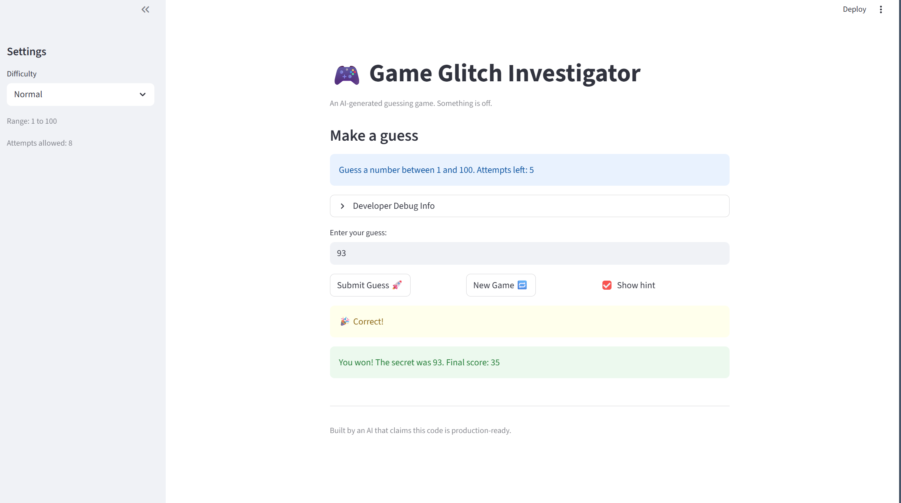
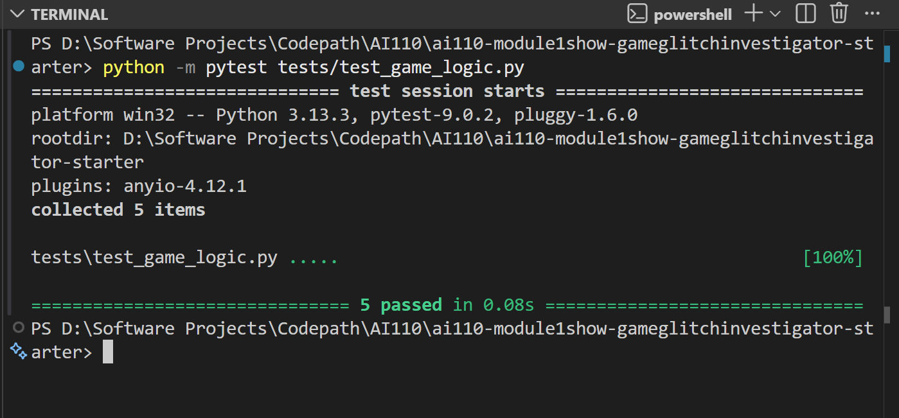

# 🎮 Game Glitch Investigator: The Impossible Guesser

## 🚨 The Situation

You asked an AI to build a simple "Number Guessing Game" using Streamlit.
It wrote the code, ran away, and now the game is unplayable. 

- You can't win.
- The hints lie to you.
- The secret number seems to have commitment issues.

## 🛠️ Setup

1. Install dependencies: `pip install -r requirements.txt`
2. Run the broken app: `python -m streamlit run app.py`

## 🕵️‍♂️ Your Mission

1. **Play the game.** Open the "Developer Debug Info" tab in the app to see the secret number. Try to win.
2. **Find the State Bug.** Why does the secret number change every time you click "Submit"? Ask ChatGPT: *"How do I keep a variable from resetting in Streamlit when I click a button?"*
3. **Fix the Logic.** The hints ("Higher/Lower") are wrong. Fix them.
4. **Refactor & Test.** - Move the logic into `logic_utils.py`.
   - Run `pytest` in your terminal.
   - Keep fixing until all tests pass!

## 📝 Document Your Experience

The game is a number guessing game built with Streamlit. The player picks a difficulty, and the game generates a secret number within a range. The player guesses numbers and gets hints telling them to go higher or lower until they find the secret or run out of attempts.

**Bugs I found:**

1. The hint messages were backwards. Guessing too high showed "Go HIGHER!" and guessing too low showed "Go LOWER!", sending the player in the wrong direction every time.
2. The attempts counter started at 1 instead of 0, which meant the player got one fewer turn than the game promised. It also caused the score to be 10 points lower than expected on a first-attempt win (70 instead of 80).
3. The info message always said "Guess a number between 1 and 100" regardless of the selected difficulty, contradicting the sidebar.

**Fixes I applied:**

1. Swapped the hint messages in `check_guess` so "Too High" tells the player to go lower and "Too Low" tells them to go higher.
2. Changed the attempts initialization from 1 to 0 in `app.py` so the counter and scoring work correctly.
3. Moved all game logic functions (`check_guess`, `parse_guess`, `get_range_for_difficulty`, `update_score`) from `app.py` into `logic_utils.py` and updated imports, separating UI code from game logic.

## 📸 Demo

## 🚀 Stretch Features

- [ ] [If you choose to complete Challenge 4, insert a screenshot of your Enhanced Game UI here]